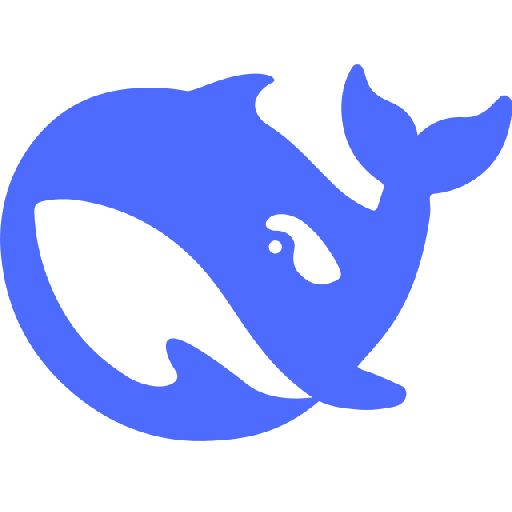

# DeepSeek Harness Desktop

English | [中文](README.zh.md)

A native desktop wrapper for the [DeepSeek Harness](https://github.com/deepseek-ai/deepseek-harness) web UI.

Uses an Electron WebView to load the locally-running dsh service. On launch, it auto-detects the environment—if `@deepseek-ai/dsh` isn't installed, it pulls it from npm; if already installed, it reuses it; if already running, it connects instantly.

<p align="center">
  
</p>

## Features

- **Auto environment check** — installs `@deepseek-ai/dsh` on first run; subsequent launches use a marker file + FS check (< 5ms)
- **Dynamic port** — defaults to 3080, auto-increments to find a free port (3080–3180) if occupied
- **Server reuse** — scans ports for an already-running dsh (verifies response signature), reuses it on any port
- **Detached process** — dsh runs detached; closing the app doesn't kill the service, next launch is instant
- **Fast startup** — calls the cached `bin.js` directly (~1.5s) instead of `npx exec` (~12s)
- **Workspace switching** — `File → Open Folder as Workspace…` restarts dsh with a new working directory
- **Multilingual** — English and Simplified Chinese; switchable via menu, persisted
- **Cross-platform** — macOS (arm64/x64) + Windows (x64 NSIS installer)

## Install

### Build from source

```bash
git clone https://github.com/lilming123/dsh-desktop.git
cd dsh-desktop
npm install

# macOS
npm run pack:mac    # outputs dist/mac-arm64/DeepSeek Harness.app

# Windows
npm run pack:win    # outputs dist/win-unpacked/DeepSeek Harness.exe
```

Drag the `.app` into `/Applications` (macOS) or run the `.exe` installer (Windows).

### Prerequisites

- [Node.js](https://nodejs.org) ≥ 18 (required at runtime; app checks on launch)
- First launch auto-installs `@deepseek-ai/dsh` (cached to `~/.npm/_npx/`)

## Usage

After launching:

1. **Splash screen** — shows 4-step progress: environment check → dsh install → server start → open UI
2. **Main window** — loads the dsh Web UI (`http://127.0.0.1:<port>`)
3. **Menu bar**
   - `File → Open Folder as Workspace…` (⌘⇧O / Ctrl+Shift+O) — pick a folder, dsh restarts with it
   - `File → Add File…` (⌘O / Ctrl+O) — pick files, paths inject into dsh input
   - `Language → English / 简体中文` — switch UI language, instant effect

### Reopening after close

dsh runs as a detached process, so it survives app quit. Next launch scans for it and connects instantly. To fully stop dsh:

```bash
# macOS
lsof -ti tcp:3080 | xargs kill -9

# Windows
netstat -ano | findstr :3080 | findstr LISTENING
# then: taskkill /F /PID <pid>
```

## Configuration

No extra config needed—dsh manages its own settings. This app only launches the dsh service and loads its UI.

### Language

UI language auto-detects from the system; switchable via the `Language` menu. Choice persists to `~/.dsh-desktop.lang`.

### Logs

Startup logs go to `~/.dsh-desktop.log` with timestamps:

```bash
tail -f ~/.dsh-desktop.log
```

## Project Structure

```
dsh-desktop/
├── main.js           # Main process: window lifecycle + setup orchestration
├── preload.js        # contextBridge: splash comms (progress / i18n / retry)
├── splash.html       # Splash UI (white bg + progress bar + whale logo + i18n)
├── icon.png          # App icon (512×512)
├── package.json      # Dependencies + electron-builder cross-platform config
├── README.md         # English docs
├── README.zh.md      # Chinese docs
└── src/
    ├── paths.js      # Cross-platform node/npx/dsh path resolution
    ├── logger.js     # Lightweight logger (stdout + ~/.dsh-desktop.log)
    ├── i18n.js       # Internationalization (en/zh, persisted)
    ├── dsh.js        # dsh lifecycle (dynamic port / reuse / start / workspace)
    ├── install.js    # dsh install detection (marker + FS fast check)
    ├── menu.js       # App menu (File / Language / Edit / View / Window)
    ├── setup.js      # Startup pipeline (4-step sequential)
    └── locales/      # Language packs
        ├── en.json
        ├── zh.json
        └── 
```

## Development

```bash
npm install
npm start            # run Electron directly (no packaging, for debugging)
```

Watch live logs:

```bash
tail -f ~/.dsh-desktop.log
```

## Technical Decisions

| Problem | Solution | Why |
|---|---|---|
| `npx exec` slow (~12s) | Call cached `bin.js` directly (~1.5s) | Bypasses npm exec package resolution overhead |
| Install check slow | `~/.dsh-desktop.installed` marker + FS check | Avoids ~8s `npx --version` |
| Electron PATH stripped → `node: not found` | `buildEnv()` prepends node/npx dirs | App bundle doesn't inherit full shell PATH |
| Port 3080 occupied | Auto-increment from 3080 to find free port | Avoids conflict, seamless to user |
| Repeated dsh startup | Scan ports for running dsh (verify response signature) | Cross-port reuse, instant connect |
| App quit kills dsh | `detached: true` + `unref()` | dsh survives, next launch instant |
| Multilingual | `src/i18n.js` + `locales/*.json` + menu switch | Supports en/zh, persisted |

## License

MIT
